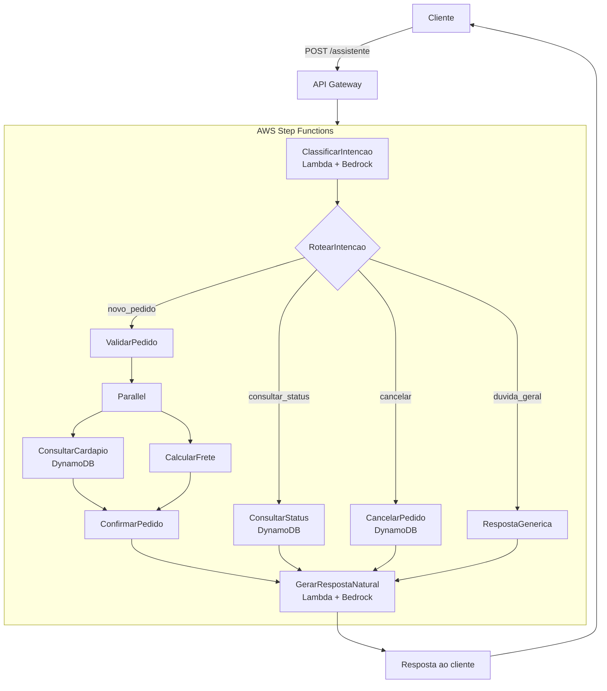

# Diagrama de Arquitetura

> Este diagrama renderiza automaticamente na visualização do GitHub.

## Fluxo de dados

1. O cliente envia uma mensagem em linguagem natural via API Gateway.
2. `ClassificarIntencao` chama o Amazon Bedrock (Claude) para transformar
   texto livre em uma intenção estruturada (`novo_pedido`,
   `consultar_status`, `cancelar` ou `duvida_geral`).
3. O estado `Choice` roteia a execução para o ramo correto.
4. Cada ramo executa lógica de negócio **determinística** (validação,
   consulta a banco de dados, cálculo de frete) — sem envolver o modelo.
5. O resultado estruturado de qualquer ramo converge para
   `GerarRespostaNatural`, que usa o Bedrock novamente, agora só para
   transformar o resultado em uma resposta em linguagem natural.
6. A resposta final volta ao cliente via API Gateway.
